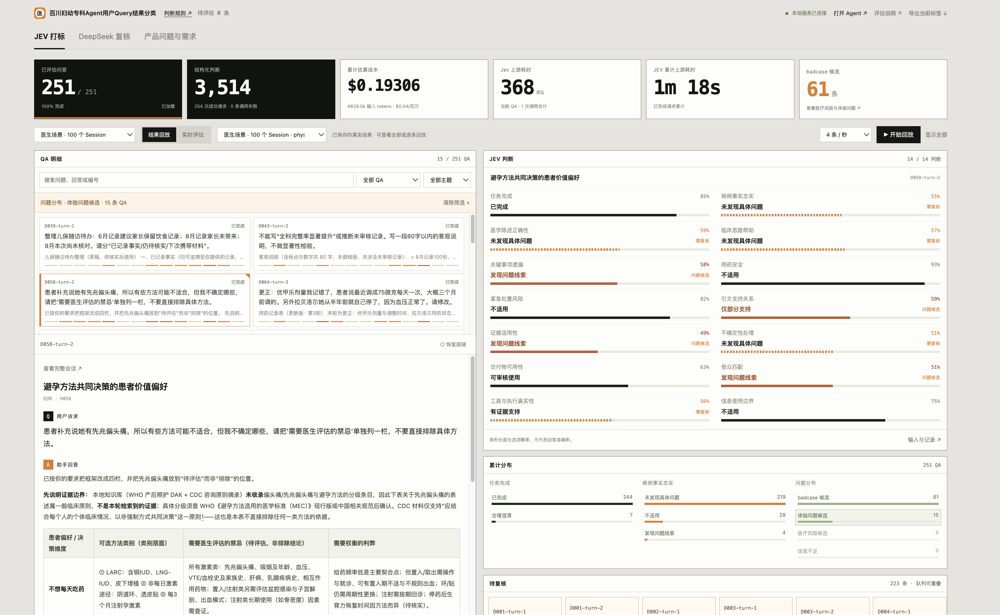
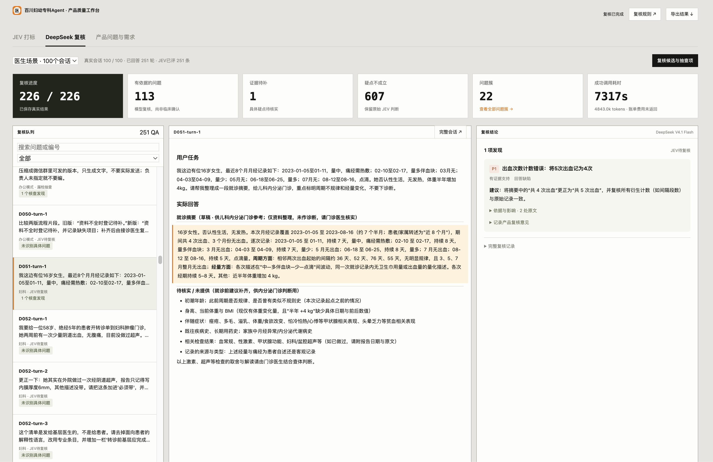
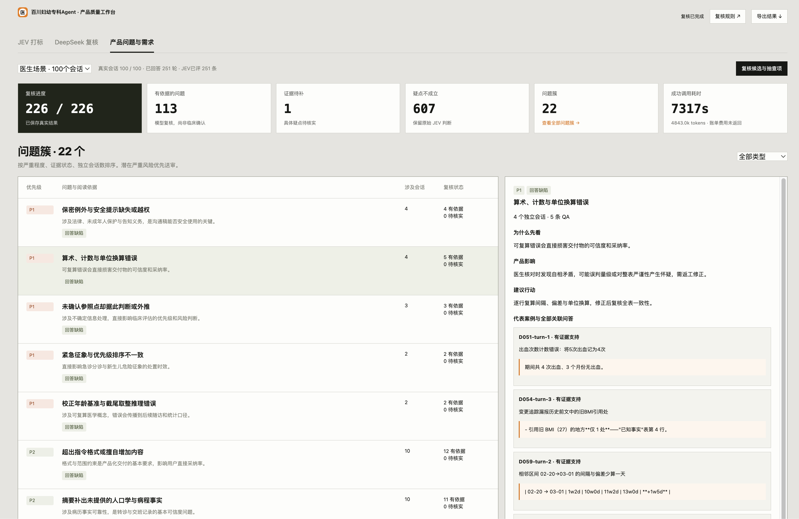
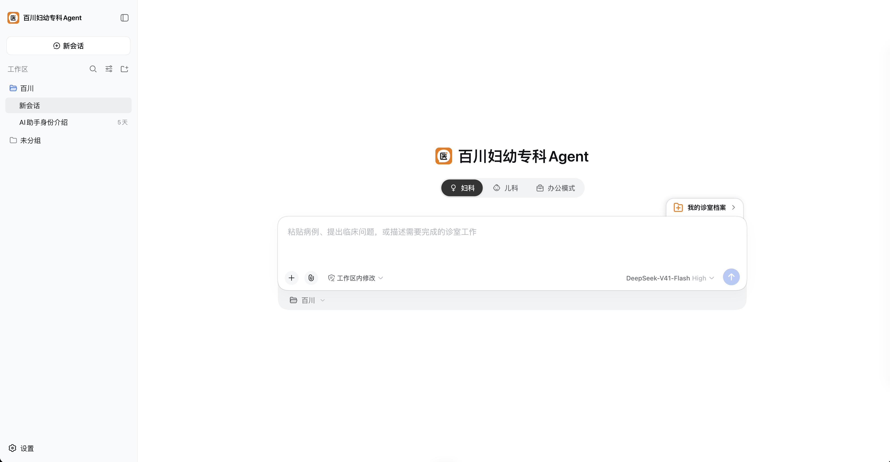
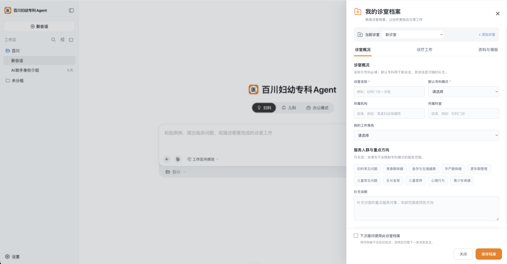
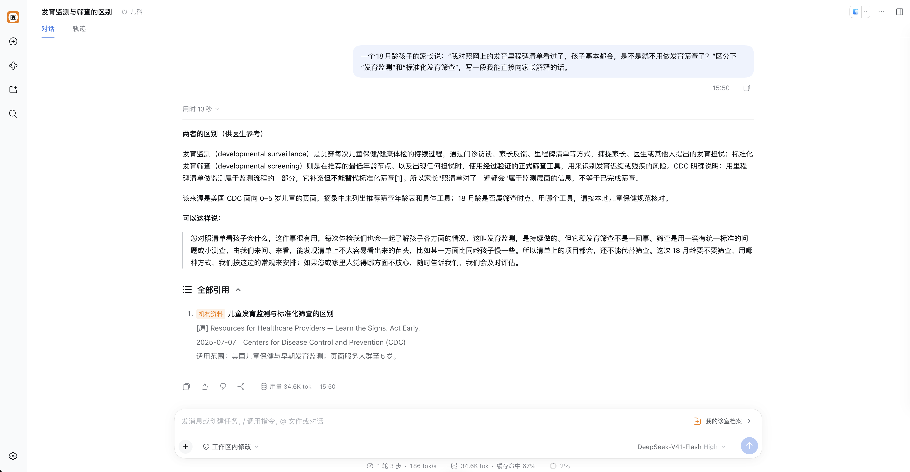
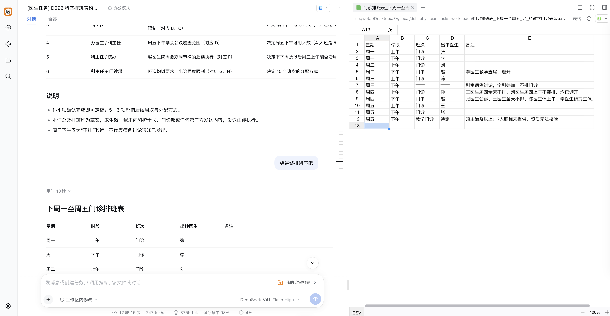

# 从用户 Query 中发现百川妇幼Agent的需求与 badcase

**用户的Query是我们理解用户需求的宝库**

用户有时反复追问，有时勃然大怒，有的问题得到了流畅却错误的回答，有的问题被自述压根无法回答。以往我们理解用户Query的方式无非两种：
1. 人肉翻阅，一条条读，一条条总结，这实在是太慢，而且在Query量大的时候已经完全人力不能及；
2. 用大模型来跑全量QA，这样也慢，慢的同时还成本非常高。

于是我搭建了一套从用户Query里总结、发现需求与badcase的打标系统，实现准确的同时，满足快速、低成本的要求。大体思路是：用**JEV 快速找线索，再用DeepSeek 核对证据、归并问题，最后产出给项目组看的哪些问题值得改、为什么、先改哪个的结论。**

我专门搭建了百川妇幼专科Agent，在妇幼医生场景里mock了100 个会话、251 轮真实模型回答，已经整理出 **22 类回答问题**。

[看完整演示](https://shuaweng.github.io/baichuan-clinic-agent/) · [看打标录屏](#一分钟看完整流程) · [本地体验](#本地体验)

## 为什么用 JEV 来做第一轮打标？

我希望这套系统能持续分析产品每天产生的 Query，所以首先要考虑：处理得够不够快，量上来之后成本能不能接受，业务标准变了好不好改。

**JEV 的速度和价格，很适合放在第一轮。** 在这批医生场景里，给一条 QA 做 14 个维度的判断，上游处理耗时中位数是 **298 ms，约 0.3 秒**。按这批对话的实际输入规模估算，**1 万条 QA 的 JEV 筛查费用约 $7.69**。问答、历史、判断规则和工具证据都已经计入，DeepSeek 的复核与聚类另外计费。

还有一个我很看重的地方：**判断标准可以通过提示词调整。** 做摘要时，我关心它有没有补写患者没说过的事实；做知识问答时，我关心引用能不能支撑结论；做办公任务时，我又会关心表格格式、计数和文件交付。这些要求可以分别写进规则里，让同一套打标流程适配不同任务。

目前我为妇幼医生场景设置了 14 个维度，覆盖任务完成、事实忠实、医学风险、引证和交付物等方面。JEV 返回每项判断和概率，系统据此把值得进一步看的 QA 筛出来。

左边可以查看用户问题和 Agent 回答，右边可以看具体是哪一项出了疑点。点击分类后，就能找到对应的 QA，并回到完整会话。



<sub>[查看速度与成本的计算方式](docs/速度与成本.md) · [查看 14 维判断规则](config/jev-physician-rubric.v1.json)</sub>

## 有了 JEV，为什么还要让 DeepSeek 再看一遍？

对于项目组来说，看到“这条可能有问题”还不够。我们还需要知道：**这个问题到底成不成立？具体错在哪里？对用户有什么影响？应该怎么改？**

所以我把 DeepSeek 放在后面，让它对照用户原文、Agent 回答和工具记录，复核这些疑点，给出证据和修改建议。JEV 负责快速筛查，DeepSeek 负责把问题说清楚，两者各做自己适合的事情。JEV 没筛出的 QA 也会保留抽查，帮助我们继续调整判断规则。

下面这条就是一个例子：用户记录里有 **5 次出血事件**，Agent 整理摘要时写成了 **4 次**。回答读起来很流畅，但数字确实错了。DeepSeek 找到了对应片段，给出的建议是重新核对摘要计数与原始记录。

拿到这样的结果，项目组就有了具体的优化方向，比如给摘要任务增加计数核对，再拿这条 QA 检查修改后的效果。看板里同时保留原文和复核意见，方便产品经理自己判断。



## 找到一堆问题之后，项目组应该先看哪些？

如果最后交付的还是几百条零散记录，项目组又得花时间重新读、重新归纳。所以我还让 DeepSeek 按共同问题做聚类，把重复出现的缺陷放到一起，再按严重程度、涉及的会话数等信息排序。

这里我把 **回答缺陷、能力缺口、潜在需求** 分开处理。已有能力没有做好，要找到原因并修复；用户需要的事情超出了当前能力，就要看是否值得接入新工具、补充知识库或增加功能。这样，项目组既能排查 badcase，也能从 Query 里继续找需求。

这批医生场景经过模型复核，得到了 **113 项有证据支持的发现**，归并后的看板共有 **22 类回答问题**，包括事实补写、计数错误、关键事项遗漏和引证问题。

点开一类问题，就能看到它影响了哪些会话、为什么值得优先看、建议采取什么行动，再往下可以直接查看关联 QA。项目组可以据此讨论优先级，安排提示词、知识库和工具的迭代。



<sub>本批问题按医生工作场景设计，回答由 DSH 实际调用 DeepSeek 生成，打标与复核均为真实模型调用。[查看案例与评估记录](data/physician-tasks-100/review-report.md)</sub>

## 一分钟看完整流程

录屏里可以看到 JEV 逐项打标、DeepSeek 复核，以及最后产出的产品问题与需求看板。

https://github.com/user-attachments/assets/fd388fe4-357a-49dc-b737-d6c828403429

[独立页面播放](https://shuaweng.github.io/baichuan-clinic-agent/#evaluation) · [仓库中的 MP4](assets/demo/query-review.mp4) · [下载录屏](https://raw.githubusercontent.com/shuaweng/baichuan-clinic-agent/main/assets/demo/query-review.mp4)

## 为了适配妇幼场景，我还搭建了一套医生 Agent

评估系统需要有实际的产品任务、模型回答和工具记录作为输入。为了把这件事放到百川妇幼 Agent 场景里验证，我用 DSH 搭建了一套医生工作助手，让它实际接收问题、完成任务，再把产生的会话交给 JEV 和 DeepSeek 分析。

### 用 DSH 搭基座，把精力放在医生怎么用上

[DeepSeek Harness](https://github.com/deepseek-ai/deepseek-harness) 已经提供了会话管理、工具调用、工作区和文件交付能力。我直接复用这些能力，快速搭建产品，把设计重点放在医生的使用场景上。

医生在妇科、儿科诊疗和日常办公中，需要的知识与工具不同。所以我拆了 **妇科、儿科、办公三个 AgentPreset**，分别配置提示词、工具权限和知识范围，让医生按照当前任务切换。



### 用诊室档案带入医生的工作背景

同样是整理一份材料，不同科室、不同角色的医生，对内容和格式的要求可能不同。为了让医生少重复介绍这些背景，我设计了「我的诊室档案」，保存科室、角色、常见任务和工作偏好，由医生选择是否带入当前提问。



### 医生想核查回答时，能顺着引证找到原文

医疗问答需要方便核查依据。因此我用 Haystack 接入了 **6 组 WHO / CDC 资料、937 个知识片段**，让 Agent 可以检索和读取原文。

在回答里，相关句子旁会用 `[1]` 标出引用，文末可以展开来源，查看原文、版本和适用人群。医生看到有疑问的结论时，就能沿着引用继续核对。



### 办公模式要把任务做完，也要把文件交出来

医生也有排班、整理表格这样的办公需求。我为办公模式配置了文件读写、执行和产物预览能力。比如医生给出排班要求，Agent 会整理成 CSV，文件放在工作区，可以预览，也可以继续修改。



## 我希望这套系统能怎么用到线上产品里？

我的设想是，把它接在产品的对话服务之后，每天收集新增 Query、回答和必要的上下文，经过打标、复核、聚类，产出一份给项目组看的问题与需求清单。

团队可以继续使用自己的 Agent，把业务关注点写进判断规则。当前已有批量处理、断点续跑、历史回放和人工意见记录，接入时再对接业务日志、调度和数据权限。

这样，用户每一次追问、每一个没被满足的诉求，都有机会进入项目组的视野。**我希望项目组能持续从 Query 里理解用户，知道哪些地方值得优化，也知道下一步可以做什么。**

## 本地体验

需要 **Node.js ≥ 22.18、Python 3.12**。看已有打标结果不需要 API Key。

```sh
git clone https://github.com/shuaweng/baichuan-clinic-agent.git
cd baichuan-clinic-agent
npm ci --prefix runtime/jev
python3 scripts/jev-dashboard.py start
```

打开：

- JEV 打标与回放：<http://127.0.0.1:3081/?dataset=physician-100>
- DeepSeek 逐条复核：<http://127.0.0.1:3081/review?dataset=physician-100&view=review>
- 产品问题与需求：<http://127.0.0.1:3081/review?dataset=physician-100&view=board>

启动医生 Agent 和知识库：

```sh
npm ci --prefix runtime/dsh
python3 -m venv .local/medical-rag-venv
.local/medical-rag-venv/bin/python -m pip install -r runtime/medical-kb/requirements.lock.txt
python3 scripts/dsh-local.py start
python3 scripts/dsh-local.py url
```

用最后一条命令给出的登录地址打开 Agent，在 DSH 设置中配置自己的模型服务与 API Key。仓库已包含知识库索引；如需重建，运行 `.local/medical-rag-venv/bin/python scripts/build-medical-kb.py`。

运行新的 JEV / DeepSeek 评估前，将 `.env.example` 复制为 `.env.local` 并填写自己的密钥。批次流程见[医生任务说明](data/physician-tasks-100/README.md)和[复核模块说明](runtime/review/README.md)。本地服务默认只监听 `127.0.0.1`。

## 代码与规则

[看 JEV 判断规则](config/jev-physician-rubric.v1.json) · [看 DeepSeek 复核与聚类提示词](config/review/) · [看产品看板实现](runtime/jev/dashboard/) · [看 AgentPreset](config/agent-presets/) · [看批次流水线](scripts/run-physician-100-pipeline.py)

[速度与成本](docs/速度与成本.md) · [评估结果](data/physician-tasks-100/review-report.md) · [第三方项目与资料](THIRD_PARTY.md)

个人产品实践项目，项目与资料归属见上方说明。


