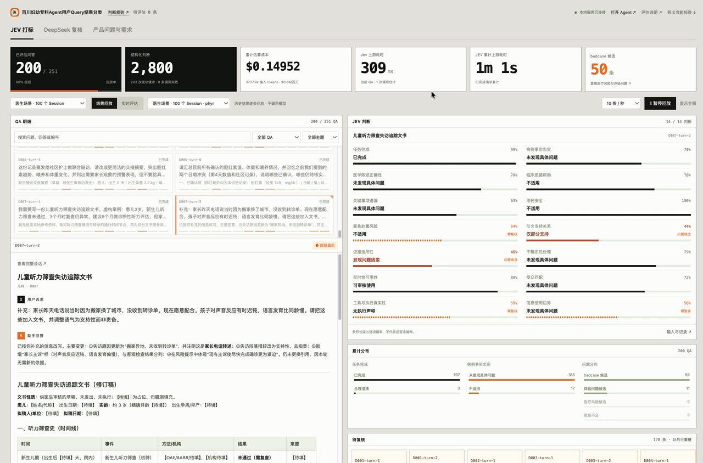

# 百川妇幼专科 Agent

**从医生的一次提问，到产品的一次改进。**

面向妇科、儿科诊室的 AI 工作助手：用 DSH 搭建工作环境，用 AgentPreset 组织专科能力，再用 JEV + DeepSeek 把对话转成可追踪的产品问题和需求。

[查看产品演示](https://shuaweng.github.io/baichuan-clinic-agent/) · [观看打标录屏](https://shuaweng.github.io/baichuan-clinic-agent/#evaluation) · [阅读评估结果](data/physician-tasks-100/review-report.md)


## 三个产品设计

### 1. 站在 DSH 上，快速把产品做出来

基于 [DeepSeek Harness](https://github.com/deepseek-ai/deepseek-harness) **0.1.7-rc.2**，复用会话、工具调用、工作区和文件交付能力。开发精力集中在医生场景、专科知识和产品体验，缩短从想法到可用产品的路径。

### 2. 按医生的工作切换能力

同一个医生，在不同任务里需要不同的助手。三个 AgentPreset 分别配置提示词、工具权限和任务入口。

| 模式 | 医生会交给它什么任务 | 配套能力 |
| --- | --- | --- |
| 妇科 | 整理复诊材料、核对病程冲突、准备患者沟通内容 | 专科提示词、资料检索、诊室背景 |
| 儿科 | 梳理发育评估、查证筛查依据、起草家长沟通内容 | 儿科知识范围、原文查阅、句旁引证 |
| 办公模式 | 排班、整理表格、起草文档、交付 CSV 等文件 | 文件读写、执行工具、产物预览 |

**诊室档案**记录科室、医生角色、常见任务和工作偏好。医生选择是否将档案带入当前提问，减少反复介绍背景。


**回答可以追到来源。** Haystack 驱动本地 RAG，已接入 6 组 WHO / CDC 资料、937 个知识片段。检索结果带有出处、版本、适用人群和原文定位；正文用 `[1]` 标注，文末可展开全部引用。


**办公任务直接交付文件。** 例如将排班要求整理为 CSV，医生在工作区预览和使用。


### 3. 让用户 Query 持续反哺产品

对话产生之后，产品团队需要知道：哪些问题答得不好，哪些能力值得补齐，哪些问题应该先处理。

```text
医生 Query → DSH 生成回答 → JEV 逐项筛查
                               ↓
                    DeepSeek 核查问题与原文证据
                               ↓
                    按严重程度排序、归并问题簇
                               ↓
                    产品经理查看 QA、记录处理意见
```

- **JEV 做第一轮筛查**：14 个维度覆盖任务完成、事实忠实、医学陈述、用药与紧急处置、引证、交付物和使用体验。
- **DeepSeek 做复核**：逐项判断疑点是否成立，给出原文证据、工作影响、修改建议和优先级；对未命中的 QA 保留抽查。
- **看板帮助做决策**：从问题簇回到具体 Session 和 Query，核对证据，记录复核意见，推动提示词、工具与知识库迭代。

流水线支持批量运行、断点续跑和结果回放，可以接入每日新增 Query 的处理任务。目前仓库提供完整批次脚本，定时调度由部署环境接入。

### JEV 打标与 DeepSeek 复核录屏

60 秒看完整流程：JEV 逐项打标、DeepSeek 核查证据，再进入产品问题与需求看板。

[](https://shuaweng.github.io/baichuan-clinic-agent/#evaluation)

**[▶ 在线播放](https://shuaweng.github.io/baichuan-clinic-agent/#evaluation)** · **[查看仓库中的 MP4](assets/demo/query-review.mp4)** · [下载视频](https://raw.githubusercontent.com/shuaweng/baichuan-clinic-agent/main/assets/demo/query-review.mp4)

## 已跑出的结果

| 指标 | 当前医生场景批次 |
| --- | ---: |
| Session | 100 |
| 真实模型回答 | 251 轮 |
| JEV 判断 | 3,514 项，14 维 / QA |
| DeepSeek 复核 | 226 条 QA |
| 有证据支持的问题发现 | 113 项 |
| 问题簇 | 22 个，包含 1 项证据待补发现 |
| JEV 估算费用 | 约 **$0.19** |

会话长度为 1–10 轮，覆盖 40 组妇科、40 组儿科、20 组办公任务。问题来自设计的医生工作场景，回答通过 DSH 实际调用 DeepSeek 生成，打标和复核均为真实模型调用。

一个具体发现：**D051-turn-1 的原始记录有 5 次出血事件，回答摘要写成了 4 次。** 这类问题容易藏在通顺的回答中。复核看板把原文、回答片段和改进建议放在一起，方便产品经理定位。

费用按本批 JEV 输入量 4,826,485 tokens、$0.04 / 百万 tokens 估算，仅包含 JEV；DeepSeek 回答与复核费用另计。113 项是模型复核发现，尚未经过临床专家签核。

## 本地体验

需要 **Node.js ≥ 22.18、Python 3.12**。看已有打标结果不需要 API Key。

```sh
git clone https://github.com/shuaweng/baichuan-clinic-agent.git
cd baichuan-clinic-agent
npm ci --prefix runtime/jev
python3 scripts/jev-dashboard.py start
```

打开：

- JEV 打标与回放：<http://127.0.0.1:3081/?dataset=physician-100>
- DeepSeek 逐条复核：<http://127.0.0.1:3081/review?dataset=physician-100&view=review>
- 产品问题与需求：<http://127.0.0.1:3081/review?dataset=physician-100&view=board>

启动医生 Agent 和知识库：

```sh
npm ci --prefix runtime/dsh
python3 -m venv .local/medical-rag-venv
.local/medical-rag-venv/bin/python -m pip install -r runtime/medical-kb/requirements.lock.txt
python3 scripts/dsh-local.py start
python3 scripts/dsh-local.py url
```

用最后一条命令给出的登录地址打开 Agent，在 DSH 设置中配置自己的模型服务与 API Key。仓库已包含知识库索引；如需重建，运行 `.local/medical-rag-venv/bin/python scripts/build-medical-kb.py`。

运行新的 JEV / DeepSeek 评估前，将 `.env.example` 复制为 `.env.local` 并填写自己的密钥。批次流程见[医生任务说明](data/physician-tasks-100/README.md)和[复核模块说明](runtime/review/README.md)。本地服务默认只监听 `127.0.0.1`。

## 看实现

| 内容 | 位置 |
| --- | --- |
| 三个 AgentPreset 与表达风格 | [config/agent-presets](config/agent-presets/) |
| 专科知识库与检索工具 | [runtime/medical-kb](runtime/medical-kb/) |
| JEV 的 14 维判断规则 | [config/jev-physician-rubric.v1.json](config/jev-physician-rubric.v1.json) |
| DeepSeek 复核与聚类提示词 | [config/review](config/review/) |
| 100 个会话与评估结果 | [data/physician-tasks-100](data/physician-tasks-100/) |
| 产品质量看板 | [runtime/jev/dashboard](runtime/jev/dashboard/) |
| 批次流水线 | [scripts/run-physician-100-pipeline.py](scripts/run-physician-100-pipeline.py) |

## 项目与资料

这是一个面向医生工作流的个人产品实践项目。项目使用的品牌素材、DSH、JEV 及模型服务归各自权利人所有。第三方医疗资料保留来源与许可，详见 [THIRD_PARTY.md](THIRD_PARTY.md)。演示页展示产品与已保存的运行结果；在线调用模型请在本地配置自己的服务。


